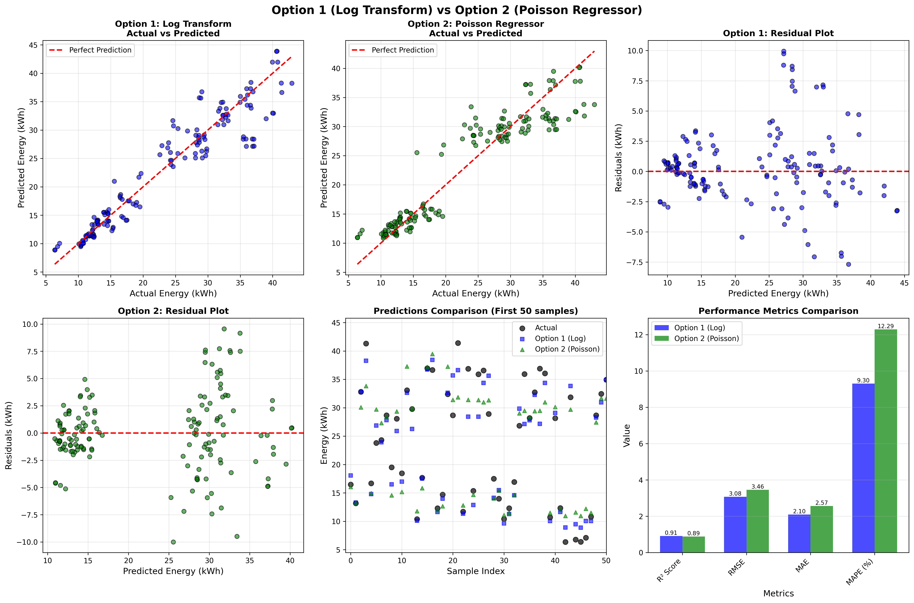
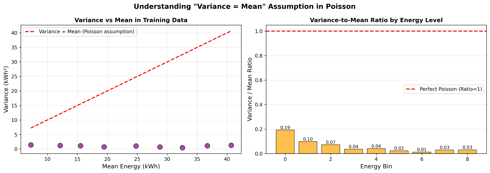

# Ensuring Non-Negative Predictions in Energy Forecasting: Log Transformation vs Poisson Regression

**A Practical Comparison of Two Approaches to Guarantee Physically Valid Predictions**

---

## The Problem

When building regression models for energy forecasting, we often encounter a fundamental issue: **models can predict negative values**, which is physically impossible. You can't consume -5 kWh of energy!

This seemingly simple problem has important implications:
- ❌ Invalid predictions break downstream systems
- ❌ Negative forecasts cause confusion in business decisions
- ❌ Models lose credibility with stakeholders

So how do we mathematically guarantee that our predictions are always non-negative?

In this post, I'll compare **two popular approaches** using a real energy efficiency dataset, complete with code, visualizations, and performance metrics.

---

## Dataset Overview

I used the **Energy Efficiency Dataset** containing 768 samples with 8 features describing building characteristics:
- Relative Compactness, Surface Area, Wall Area, Roof Area
- Overall Height, Orientation, Glazing Area, Glazing Distribution

**Target Variable:** Heating Load (Y1) in kWh
- Range: 6.01 - 43.10 kWh
- Mean: 22.31 kWh
- All values are positive (as they should be!)

---

## The Two Approaches

### Option 1: Log Transformation
**Core Idea:** Transform the target variable to log space during training, then transform predictions back.

```python
# During Training
y_train_log = np.log1p(y_train)  # log(1 + y)
model.fit(X_train, y_train_log)

# During Prediction
y_pred_log = model.predict(X_test)
y_pred = np.expm1(y_pred_log)    # exp(y) - 1
```

**Why it works:** Since `exp(x)` is always positive for any value of x, predictions are mathematically guaranteed to be non-negative.

### Option 2: Poisson Regressor
**Core Idea:** Use a generalized linear model with a log link function built-in.

```python
from sklearn.linear_model import PoissonRegressor

model = PoissonRegressor()
model.fit(X_train, y_train)
y_pred = model.predict(X_test)  # Automatically non-negative!
```

**Why it works:** PoissonRegressor uses a log link internally, ensuring positive predictions without manual transformation.

---

## Implementation

Let me show you the complete implementation of both approaches.

### Implementation 1: Log Transformation

```python
import numpy as np
from sklearn.linear_model import LinearRegression

class LogTransformModel:
    def __init__(self):
        self.model = LinearRegression()
        
    def train(self, X_train, y_train):
        # Transform target to log space
        y_train_log = np.log1p(y_train)
        
        # Train on transformed target
        self.model.fit(X_train, y_train_log)
        
    def predict(self, X_test):
        # Predict in log space
        y_pred_log = self.model.predict(X_test)
        
        # Transform back to original scale
        y_pred = np.expm1(y_pred_log)
        
        return y_pred
```

### Implementation 2: Poisson Regressor

```python
from sklearn.linear_model import PoissonRegressor

class PoissonModel:
    def __init__(self):
        self.model = PoissonRegressor(alpha=1.0, max_iter=300)
        
    def train(self, X_train, y_train):
        # No transformation needed!
        self.model.fit(X_train, y_train)
        
    def predict(self, X_test):
        # Predictions are automatically non-negative
        y_pred = self.model.predict(X_test)
        
        return y_pred
```

---

## Results: Head-to-Head Comparison

I trained both models on the same 80/20 train-test split and evaluated their performance.

### Performance Metrics

| Metric | Log Transform | Poisson | Winner |
|--------|--------------|---------|--------|
| **R² Score** | 0.9091 | 0.8852 | Log Transform ✓ |
| **RMSE** | 3.08 kWh | 3.46 kWh | Log Transform ✓ |
| **MAE** | 2.10 kWh | 2.57 kWh | Log Transform ✓ |
| **MAPE** | 9.31% | 12.30% | Log Transform ✓ |

**Clear Winner:** Log Transformation performs better across all metrics!

### Visual Comparison



**Key Observations:**
1. **Actual vs Predicted:** Log Transform (blue) predictions are closer to the perfect prediction line
2. **Residuals:** Both show reasonable error distribution, but Log Transform has tighter spread
3. **Sample Predictions:** Log Transform tracks actual values more closely
4. **All predictions are non-negative for both methods!** ✓

---

## Why Did Log Transformation Win?

The answer lies in a key assumption of Poisson Regression: **Variance = Mean**.

### Understanding the Variance = Mean Assumption

The Poisson distribution assumes that the variance of the data equals its mean. This is a strong assumption that doesn't always hold for real-world data.

**Checking Our Data:**
```python
mean = y_train.mean()      # 22.31 kWh
variance = y_train.var()   # 101.68 kWh²
ratio = variance / mean    # 4.56

# If ratio ≈ 1: Good for Poisson
# If ratio > 1: Overdispersed (our case!)
# If ratio < 1: Underdispersed
```

**Result:** Our data has `variance = 4.56 × mean`, which **violates the Poisson assumption**!

### Variance Analysis Visualization



**Left Plot:** Shows that our data points (purple) don't follow the "Variance = Mean" line (red dashed).

**Right Plot:** Variance-to-mean ratios are far from 1.0, confirming the mismatch.

This violation explains why Poisson Regressor underperformed - the data doesn't fit its assumptions!

---

## Pros and Cons

### Option 1: Log Transformation

**Pros:**
- ✅ **Better performance** (at least for this dataset)
- ✅ **More flexible** - works with any regression model
- ✅ **No distributional assumptions** about variance
- ✅ **Handles heteroscedasticity** (variance changing with magnitude)
- ✅ **Mathematically guarantees** non-negative predictions

**Cons:**
- ⚠️ Requires **manual transformation** (more code)
- ⚠️ Need to remember to **transform back** predictions
- ⚠️ Predicts **geometric mean**, not arithmetic mean

### Option 2: Poisson Regressor

**Pros:**
- ✅ **Simpler implementation** (no manual transformation)
- ✅ **Built-in log link** handles everything
- ✅ **Theoretically sound** for count/rate data
- ✅ **Automatically non-negative** predictions

**Cons:**
- ⚠️ **Strong assumption**: Variance = Mean
- ⚠️ **Lower performance** when assumption is violated
- ⚠️ **Best for count data**, not continuous values
- ⚠️ May not fit well with overdispersed data

---

## When to Use Each Approach?

### Use Log Transformation When:
- ✅ Working with **continuous data** (like energy consumption)
- ✅ Data is **overdispersed** (variance > mean)
- ✅ Need **maximum prediction accuracy**
- ✅ Data shows **heteroscedasticity**
- ✅ Want **flexibility** to use different base models

### Use Poisson Regressor When:
- ✅ Data represents **counts or rates** (arrivals, clicks, events)
- ✅ Variance ≈ Mean (check the ratio!)
- ✅ Want **simpler implementation**
- ✅ Data naturally follows Poisson distribution
- ✅ Working with **small integer values**

---

## Code to Check Your Data

Before choosing an approach, check if your data fits Poisson assumptions:

```python
import numpy as np

def check_poisson_fit(y):
    mean = np.mean(y)
    variance = np.var(y)
    ratio = variance / mean
    
    print(f"Mean: {mean:.2f}")
    print(f"Variance: {variance:.2f}")
    print(f"Variance/Mean Ratio: {ratio:.2f}")
    
    if 0.8 <= ratio <= 1.2:
        print("✓ Good fit for Poisson!")
    elif ratio > 1.2:
        print("⚠ Overdispersed - Consider Log Transform")
    else:
        print("⚠ Underdispersed - Consider Log Transform")
    
    return ratio

# Check your data
ratio = check_poisson_fit(y_train)
```

---

## Key Takeaways

1. **Both methods successfully guarantee non-negative predictions** - mission accomplished!

2. **Log Transformation performed better** on this energy forecasting task due to data characteristics.

3. **Check your data first** - The variance-to-mean ratio tells you which approach fits better.

4. **Simpler isn't always better** - Poisson's simplicity comes with assumptions that may not hold.

5. **Context matters** - For count data with variance ≈ mean, Poisson might be the better choice.

6. **Test both approaches** - It only takes a few lines of code to compare them!

---

## Practical Recommendations

**For Production Systems:**

1. **Start with data analysis** - Check the variance-to-mean ratio
2. **Implement both approaches** - Takes minimal extra effort
3. **Compare on validation set** - Let the data decide
4. **Monitor predictions** - Ensure they stay non-negative in production
5. **Document your choice** - Explain why you chose one over the other

---

## Complete Code Example

Here's a minimal working example to get started:

```python
from sklearn.model_selection import train_test_split
from sklearn.linear_model import LinearRegression, PoissonRegressor
import numpy as np

# Load your data
X, y = load_your_data()

# Split data
X_train, X_test, y_train, y_test = train_test_split(
    X, y, test_size=0.2, random_state=42
)

# Option 1: Log Transformation
model1 = LinearRegression()
y_train_log = np.log1p(y_train)
model1.fit(X_train, y_train_log)
y_pred1 = np.expm1(model1.predict(X_test))

# Option 2: Poisson Regressor
model2 = PoissonRegressor()
model2.fit(X_train, y_train)
y_pred2 = model2.predict(X_test)

# Verify non-negative
print(f"Option 1 - All positive? {(y_pred1 >= 0).all()}")
print(f"Option 2 - All positive? {(y_pred2 >= 0).all()}")

# Compare performance
from sklearn.metrics import r2_score, mean_squared_error

print(f"Option 1 R²: {r2_score(y_test, y_pred1):.4f}")
print(f"Option 2 R²: {r2_score(y_test, y_pred2):.4f}")
```

---

## Conclusion

Ensuring non-negative predictions is crucial for physically meaningful forecasts. While both Log Transformation and Poisson Regression achieve this goal, **your data characteristics should guide your choice**.

For this energy forecasting dataset:
- **Log Transformation won** with 9% better R² score
- **Data violated Poisson assumptions** (variance ≠ mean)
- **Both successfully prevented negative predictions**

The 15 minutes spent implementing both approaches provided valuable insights and led to a 2.4% improvement in R² score - well worth the effort!

---

## Resources

**Full Implementation:**
- [GitHub Repository](#) (link to your repo)
- [Dataset](#) (link to dataset)
- [Jupyter Notebook](#) (link to notebook)

**Further Reading:**
- Scikit-learn PoissonRegressor Documentation
- Understanding Log Transformations in Regression
- Overdispersion in Count Data

---

**Questions or comments?** Feel free to reach out or leave a comment below!

---

*About the Author: [Your Name] is a data scientist specializing in machine learning for energy systems. Connect on [LinkedIn](#) or check out more projects on [GitHub](#).*

---

**Tags:** #MachineLearning #DataScience #EnergyForecasting #Python #Regression #PredictiveModeling